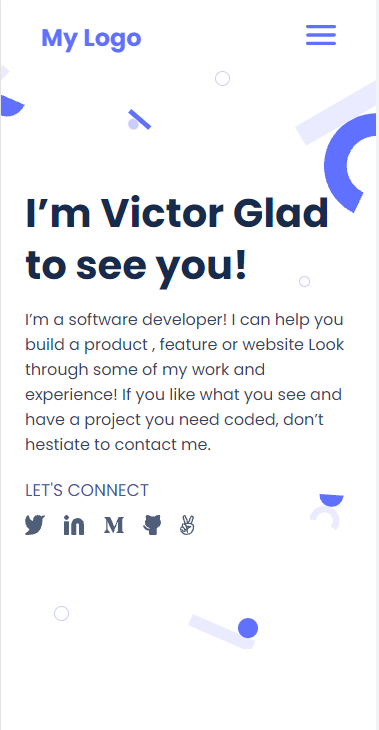

# Porfolio

>This is my personal porfolio.

  

This project is from the Microverse curriculum. It's main objective is to help student understand how to parse a Figma design to create a user interface and also help student build their portfolio.

## Built With

- HTML & CSS

## Live Demo

[Live Demo Link](https://chukwuemeka1234.github.io/portfolio/)

## Getting Started

To get a local copy up and running follow these simple example steps.

1. Clone this repository or download the Zip folder:
**''git clone https://github.com/chukwuemeka1234/Portfolio.git''**

2. Navigate to the location of the folder in your machine:
**''you@your-Pc-name:~$ cd <folder>''**

## Authors

👤 **Author**

- GitHub: [@chukwuemeka1234](https://github.com/chukwuemeka1234)
- Twitter: [@avc_victor](https://twitter.com/@avc_victor)
- LinkedIn: [ani-chukwuemeka](https://linkedin.com/in/ani-chukwuemeka-a65421199/)

## 🤝 Contributing

Contributions, issues, and feature requests are welcome!

Feel free to check the [issues page](../../issues/).

## Show your support

Give a ⭐️ if you like this project!

## Acknowledgments

- Hat tip to anyone whose code was used
- Inspiration
- etc

## 📝 License

This project is [MIT](./MIT.md) licensed.
